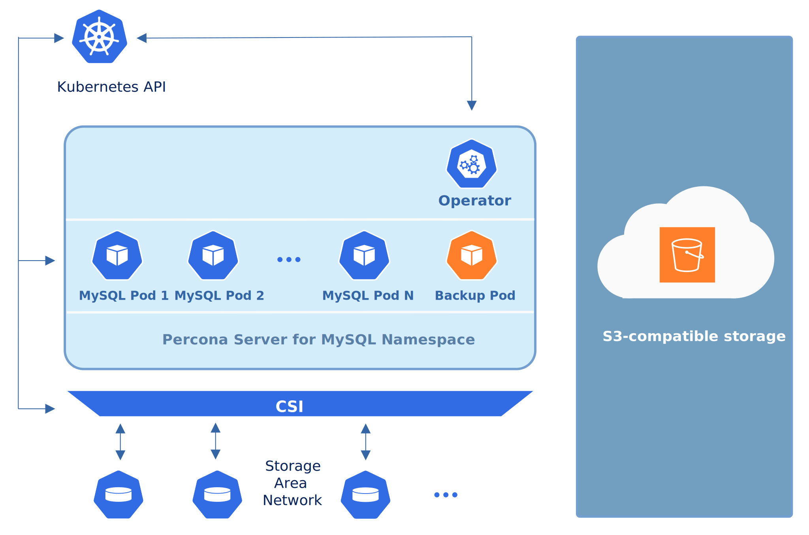

.. _backups:

Providing Backups
=================

The Operator stores Percona Distribution for MySQL backups outside the
Kubernetes cluster: on `Amazon S3 or S3-compatible storage <https://en.wikipedia.org/wiki/Amazon_S3#S3_API_and_competing_services>`_,
or on `Azure Blob Storage <https://azure.microsoft.com/en-us/services/storage/blobs/>`_.

The Operator currently allows doing cluster backup *on-demand* (i.e. manually at
any moment). It uses the `Percona XtraBackup <https://docs.percona.com/percona-xtrabackup/latest/>`_ tool.

Backups are controlled by the ``backup`` section of the
`deploy/cr.yaml <https://github.com/percona/percona-server-mysql-operator/blob/main/deploy/cr.yaml>`__
file. This section contains :ref:`backup.enabled<backup-enabled>` key (it should
be set to ``true`` to enable backups), and the number of options in the
``storages`` subsection, needed to access cloud to store backups.

.. contents:: :local:

.. _backups.scheduled-s3:

Backups on Amazon S3 or S3-compatible storage
---------------------------------------------

Since backups are stored separately on the Amazon S3, a secret with
``AWS_ACCESS_KEY_ID`` and ``AWS_SECRET_ACCESS_KEY`` should be present on
the Kubernetes cluster. The secrets file with these base64-encoded keys should
be created: for example ``deploy/backup-s3.yaml`` file with the following
contents.

.. code:: yaml

   apiVersion: v1
   kind: Secret
   metadata:
     name: cluster1-s3-credentials
   type: Opaque
   data:
     AWS_ACCESS_KEY_ID: UkVQTEFDRS1XSVRILUFXUy1BQ0NFU1MtS0VZ
     AWS_SECRET_ACCESS_KEY: UkVQTEFDRS1XSVRILUFXUy1TRUNSRVQtS0VZ

.. note:: The following command can be used to get a base64-encoded string from
   a plain text one: ``$ echo -n 'plain-text-string' | base64``

The ``name`` value is the `Kubernetes
secret <https://kubernetes.io/docs/concepts/configuration/secret/>`_
name which will be used further, and ``AWS_ACCESS_KEY_ID`` and
``AWS_SECRET_ACCESS_KEY`` are the keys to access S3 storage (and
obviously they should contain proper values to make this access
possible). To have effect secrets file should be applied with the
appropriate command to create the secret object,
e.g. ``kubectl apply -f deploy/backup-s3.yaml`` (for Kubernetes).

All the data needed to access the S3-compatible cloud to store backups should be
put into the ``backup.storages`` subsection. Here is an example
of `deploy/cr.yaml <https://github.com/percona/percona-server-mysql-operator/blob/main/deploy/cr.yaml>`__
which uses Amazon S3 storage for backups:

.. code:: yaml

   ...
   backup:
     enabled: true
     ...
     storages:
       s3-us-west:
         type: s3
         s3:
           bucket: S3-BACKUP-BUCKET-NAME-HERE
           region: us-west-2
           credentialsSecret: cluster1-s3-credentials

If you use some S3-compatible storage instead of the original
Amazon S3, the `endpointURL <https://docs.min.io/docs/aws-cli-with-minio.html>`_ is needed in the ``s3`` subsection which points to the actual cloud used for backups and
is specific to the cloud provider. For example, using `Google Cloud <https://cloud.google.com>`_ involves the `following <https://storage.googleapis.com>`_ endpointUrl:

.. code:: yaml

   endpointUrl: https://storage.googleapis.com

Also you can use :ref:`prefix<backup-storages-s3-prefix>` option to specify the
path (sub-folder) to the backups inside the S3 bucket. If prefix is not set,
backups are stored in the root directory.

The options within this subsection are further explained in the
:ref:`Operator Custom Resource options<operator.backup-section>`.

One option which should be mentioned separately is
``credentialsSecret`` which is a `Kubernetes
secret <https://kubernetes.io/docs/concepts/configuration/secret/>`_
for backups. Value of this key should be the same as the name used to
create the secret object (``cluster1-s3-credentials`` in the last
example).

.. _backups.scheduled-azure:

Backups on Microsoft Azure Blob storage
---------------------------------------

Since backups are stored separately on `Azure Blob Storage <https://azure.microsoft.com/en-us/services/storage/blobs/>`_,
a secret with ``AZURE_STORAGE_ACCOUNT_NAME`` and ``AZURE_STORAGE_ACCOUNT_KEY`` should be present on
the Kubernetes cluster. The secrets file with these base64-encoded keys should
be created: for example ``deploy/backup-azure.yaml`` file with the following
contents.

.. code:: yaml

   apiVersion: v1
   kind: Secret
   metadata:
     name: cluster1-azure-credentials
   type: Opaque
   data:
     AZURE_STORAGE_ACCOUNT_NAME: UkVQTEFDRS1XSVRILUFXUy1BQ0NFU1MtS0VZ
     AZURE_STORAGE_ACCOUNT_KEY: UkVQTEFDRS1XSVRILUFXUy1TRUNSRVQtS0VZ

.. note:: The following command can be used to get a base64-encoded string from
   a plain text one: ``$ echo -n 'plain-text-string' | base64``

The ``name`` value is the `Kubernetes
secret <https://kubernetes.io/docs/concepts/configuration/secret/>`_
name which will be used further, and ``AZURE_STORAGE_ACCOUNT_NAME`` and
``AZURE_STORAGE_ACCOUNT_KEY`` credentials will be used to access the storage
(and obviously they should contain proper values to make this access
possible). To have effect secrets file should be applied with the appropriate
command to create the secret object, e.g.
``kubectl apply -f deploy/backup-azure.yaml`` (for Kubernetes).

All the data needed to access the Azure Blob storage to store backups should be
put into the ``backup.storages`` subsection. Here is an example
of `deploy/cr.yaml <https://github.com/percona/percona-server-mysql-operator/blob/main/deploy/cr.yaml>`__
which uses Azure Blob storage for backups:

.. code:: yaml

   ...
   backup:
     enabled: true
     ...
     storages:
       azure-blob:
         type: azure
         azure:
           container: <your-container-name>
           prefix: psmdb
           credentialsSecret: cluster1-azure-credentials

The options within this subsection are further explained in the
:ref:`Operator Custom Resource options<operator.backup-section>`.

One option which should be mentioned separately is
``credentialsSecret`` which is a `Kubernetes
secret <https://kubernetes.io/docs/concepts/configuration/secret/>`_
for backups. Value of this key should be the same as the name used to
create the secret object (``cluster1-azure-credentials`` in the last
example).

You can use :ref:`prefix<backup-storages-azure-prefix>` option to specify the
path (sub-folder) to the backups inside the container. If prefix is not set,
backups will be stored in the root directory of the container.

.. _backups-manual:

Making on-demand backup
-----------------------

To make an on-demand backup, the user should first make changes in the 
``deploy/cr.yaml`` configuration file: set the ``backup.enabled`` key to
``true`` and configure backup storage in the ``backup.storages`` subsection. 

When the ``deploy/cr.yaml`` file
contains correctly configured keys and is applied with ``kubectl`` command, use
*a special backup configuration YAML file* with the following contents:

* **backup name** in the ``metadata.name`` key,
* **Percona Distribution for MySQL Cluster name** in the ``clusterName`` key,
* **storage name** from ``deploy/cr.yaml`` in the ``spec.storageName`` key.

The example of such file is `deploy/backup/backup.yaml <https://github.com/percona/percona-server-mysql-operator/blob/main/deploy/backup.yaml>`_.

When the backup destination is configured and applied with `kubectl apply -f deploy/cr.yaml` command, the actual backup command is executed:

.. code:: bash

   $ kubectl apply -f deploy/backup.yaml

.. note:: Storing backup settings in a separate file can be replaced by
   passing its content to the ``kubectl apply`` command as follows:

   .. code:: bash

      $ cat <<EOF | kubectl apply -f-
      apiVersion: ps.percona.com/v1alpha1
      kind: PerconaServerMySQLBackup
      metadata:
        name: backup1
      spec:
        clusterName: cluster1
        storageName: s3-us-west
      EOF

.. _backups-restore:

Restore the cluster from a previously saved backup
--------------------------------------------------

Following things are needed to restore a previously saved backup:

* Make sure that the cluster is running.

* Find out correct names for the **backup** and the **cluster**. Available
  backups can be listed with the following command:

  .. code:: bash

     $ kubectl get ps-backup

  And the following command will list existing Percona Distribution for MySQL
  Cluster names in the current Kubernetes-based environment:

  .. code:: bash

     $ kubectl get ps

When the correct names for the backup and the cluster are known, backup
restoration can be done in the following way.

1. Set appropriate keys in the ``deploy/restore.yaml`` file.

   * set ``spec.clusterName`` key to the name of the target cluster to restore
     the backup on,
   * set ``spec.backupName`` key to the name of your backup.

2. After that, the actual restoration process can be started as follows:

   .. code:: bash

      $ kubectl apply -f deploy/restore.yaml

.. note:: Storing backup settings in a separate file can be replaced by passing
   its content to the ``kubectl apply`` command as follows:

   .. code:: bash

      $ cat <<EOF | kubectl apply -f-
      apiVersion: "pxc.percona.com/v1alpha1"
      kind: "PerconaServerMySQLRestore"
      metadata:
        name: "restore1"
      spec:
        clusterName: "cluster1"
        backupName: "backup1"
      EOF

.. _backups-delete:

Delete the unneeded backup
--------------------------

Manual deleting of a previously saved backup requires not more than the backup
name. This name can be taken from the list of available backups returned
by the following command:

.. code:: bash

   $ kubectl get ps-backup

When the name is known, backup can be deleted as follows:

.. code:: bash

   $ kubectl delete ps-backup/<backup-name>

