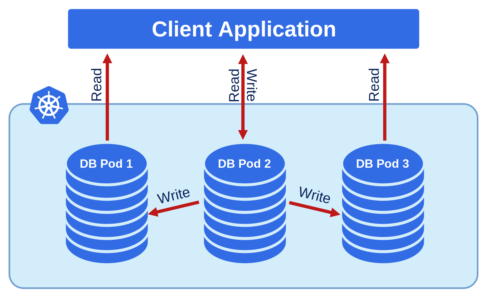
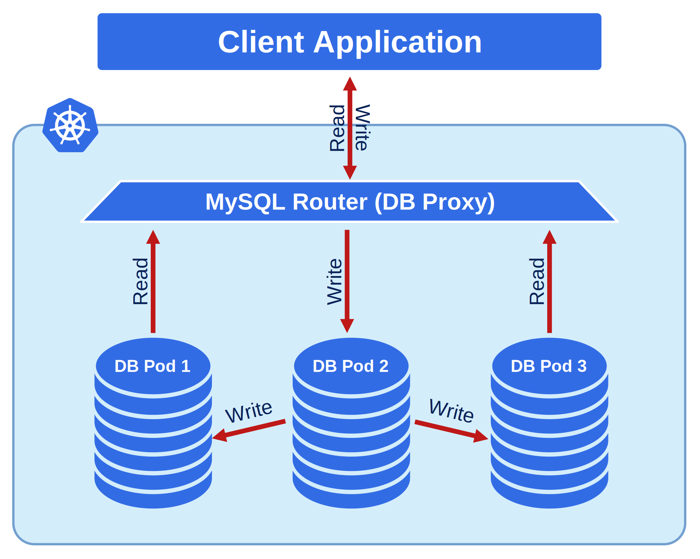

Exposing cluster
================

The cluster can be exposed with regular Kubernetes `Service <https://kubernetes.io/docs/concepts/services-networking/service/>`_ objects. 
Operator takes care of configuring Service objects. 

This document describes the usage of Custom Resource manifest options 
to expose the clusters deployed with the Operator. Expose options vary for
different replication types: Asyncronous and `Group Replicaiton <https://dev.mysql.com/doc/refman/8.0/en/group-replication.html>`_.

Asyncronous Replication
-----------------------

With Asyncronous or Semi-syncronous replication the cluster is exposed through Kubernetes Service. 
The service is called ``<CLUSTER_NAME>-mysql-primary``. For example, ``cluster1-mysql-primary``.

This Service is created by default and always present. You can change the type of the Service 
object by setting ``mysql.primaryServiceType`` variable in the Custom Resource. 

For example the following example is going to expose the Primary node of the asyncronous cluster with the LoadBalancer object:

.. code:: yaml

  mysql:
    primaryServiceType: LoadBalancer
    
Get the LoadBalancer endpoint or IP-address by getting the Service object:

.. code:: bash

  $ kubectl get service cluster1-mysql-primary
  NAME                     TYPE           CLUSTER-IP     EXTERNAL-IP     PORT(S)                                                         AGE
  cluster1-mysql-primary   LoadBalancer   10.40.37.98    35.192.172.85   3306:32146/TCP,33062:31062/TCP,33060:32026/TCP,6033:30521/TCP   3m31s

Group Replication
-----------------

`MySQL Router <https://dev.mysql.com/doc/mysql-router/8.0/en/>`_  is used to expose clusters with Group Replication. 
Network design in this case looks like this:

To configure MySQL Router use ``router`` section, and for exposure - ``router.expose``.

Set ``router.expose.type`` to specify Kubernetes Service object. The following example
is going to expose MySQL Router through a LoadBalancer object:

.. code:: yaml

  router:
    expose:
      type: LoadBalancer

Get the endpoint to connect to by getting the output of PerconaServerMySQL object:

.. code:: bash

  $ kubectl get ps
  NAME       REPLICATION         ENDPOINT        STATE   AGE
  cluster1   group-replication   35.239.63.143   ready   10m

Service per Pod
---------------

Sometimes it is required to expose all nodes, where each node gets its own IP-address. 
This is possible by setting the following options in ``spec.mysql`` section:

* ``expose.enabled`` - set it to True to enable exposure
* ``expose.type`` - defines the Kubernetes Service object type

The following example is going to create a dedicated LoadBalancer Service for each node of the MySQL cluster:

.. code:: yaml

  mysql:
    expose:
      enabled: true
      type: LoadBalancer
      
      
Get the Services as usual:

.. code:: bash

  $ kubectl get services
  NAME                     TYPE           CLUSTER-IP     EXTERNAL-IP     PORT(S)                                                         AGE
  ...
  cluster1-mysql-0         LoadBalancer   10.40.44.110   104.198.16.21   3306:31009/TCP,33062:31319/TCP,33060:30737/TCP,6033:30660/TCP   75s
  cluster1-mysql-1         LoadBalancer   10.40.42.5     34.70.170.187   3306:30601/TCP,33062:30273/TCP,33060:30910/TCP,6033:30847/TCP   75s
  cluster1-mysql-2         LoadBalancer   10.40.42.158   35.193.50.44    3306:32042/TCP,33062:31576/TCP,33060:31656/TCP,6033:31448/TCP   75s
